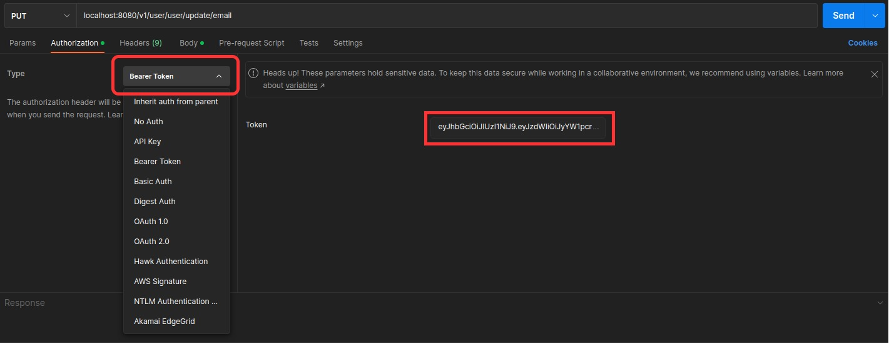

# How to use
## Set data
***Create a file named `secret.properties` in resources folder with the following content:***

    # Database
    username= <your_username>
    password= <your_password>
    
    # Email Sender
    email_username= <your_email>
    email_password= <your_email_password>

## Run ArtemisaApplication class

### Endpoints and request body are detailed in swagger

http://localhost:8080/swagger-ui.html

### Authentication on Postman

 **Send an email with a link to confirm the user**

 **Confirm the user**

 **Give the auth token**

  **Need the auth token**

**Methods without authentication:**

**Methods how need authentication:**

